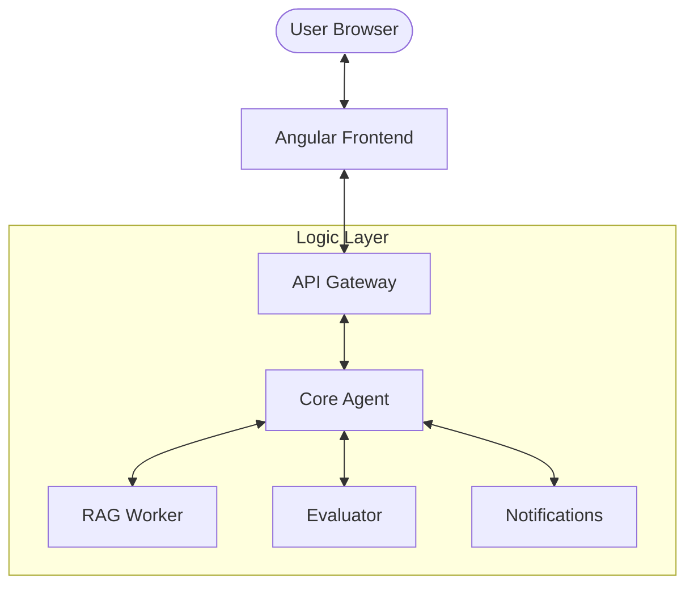

# 🤖 Learning Resolution Coach (LRC)

An AI-driven microservices platform designed to create personalized learning paths, automate tutoring via RAG, and evaluate coding/technical progress.

> [!TIP]
> **Plan → Check-in → Evaluate → Adapt**
> LRC helps users turn learning resolutions into habits using a closed feedback loop powered by advanced AI agents.

---

---

## 🏗️ High-Level Architecture

LRC is built as a distributed system of lightweight Python agents coordinated by a unified API Gateway and served through a modern Angular frontend.



---

## 📁 System Components

| App | Description | Tech Stack |
| :--- | :--- | :--- |
| **`web`** | User Dashboard & Dashboard UI | Angular 18, Vanilla CSS |
| **`gateway`** | Unified API, Auth (OAuth2), & Routing | FastAPI, Pydantic |
| **`core-agent`** | Task Planning & AI Orchestration | FastAPI, Opik (Tracing) |
| **`rag-worker`** | Semantic Knowledge Retrieval | ChromaDB, LangChain/LlamaIndex |
| **`evaluator`** | Automated Grading & Code Sandboxing | Docker-in-Docker / Isolated Exec |
| **`notif-worker`**| Async Alerts & Email Notifications | Mailpit / SendGrid |

---

## 🚀 Quick Start (Docker)

If you have Docker installed, you can spin up the entire ecosystem in one command:

```bash
docker-compose up --build
```

- **Frontend**: [http://localhost:4200](http://localhost:4200)
- **API Documentation**: [http://localhost:8000/docs](http://localhost:8000/docs)

---

## 🛠️ Tech Stack & Integration

- **Language**: Python 3.11+ / TypeScript
- **Frameworks**: FastAPI, Angular 18
- **AI/LLM**: Support for OpenAI, Anthropic, Azure, and Local LLMs (Ollama)
- **Observability**: Real-time tracing via **Opik**
- **Database**: PostgreSQL (Relational) & ChromaDB (Vector)

---

## 📄 License

This project is licensed under the MIT License.
